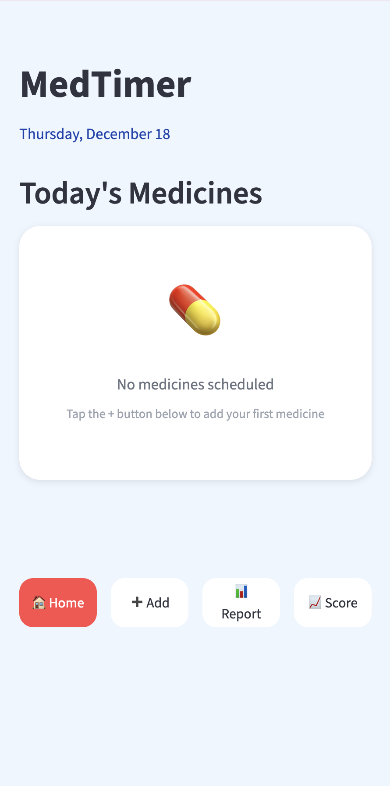
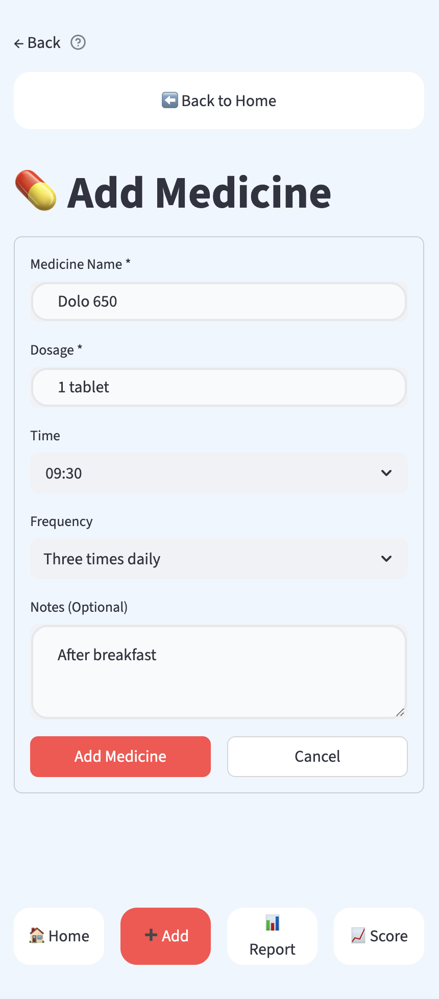
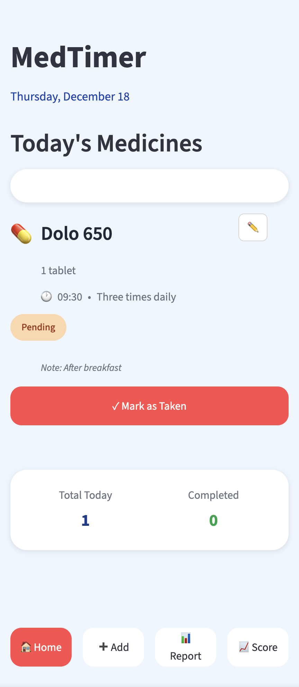
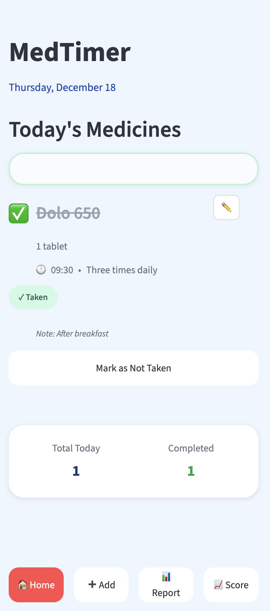
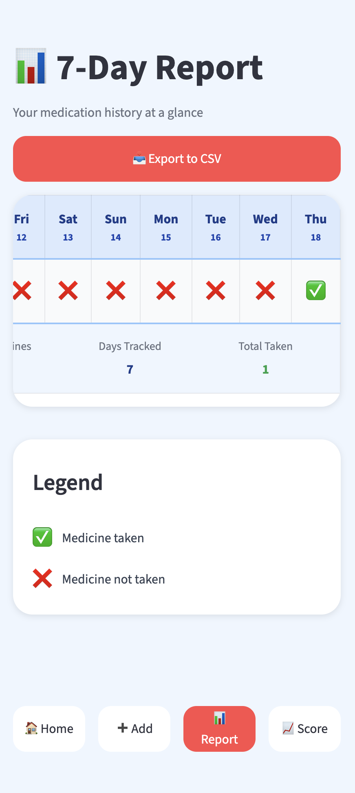
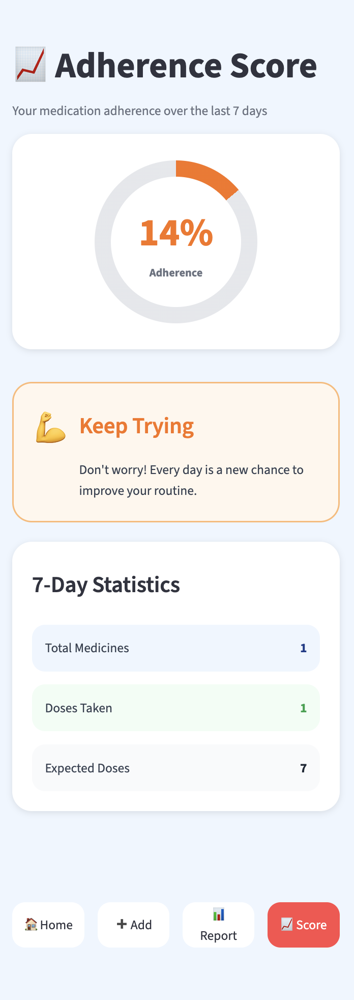

# IDAI1021000465-Nihith-Ram-Bikkina

# MedTimer Daily Medicine Companion

# Candidate Name - Nihith Ram Bikkina

# Candidate Registration Number - 1000465

# CRS Name: Artificial Intelligence

# Course Name - Design and Deploy Interactive Python Applications for Social Good

# School name - Birla Open Minds International School, Kollur

# Summative Assessment 2

**Project Overview**

MedTimer is a senior-friendly daily medicine tracking web application built using Python and Streamlit. It allows users to add medicines with scheduled times, view a color-coded daily checklist (Green = Taken, Yellow = Upcoming, Red = Missed), and automatically calculate a weekly adherence score. The app provides motivational tips and Turtle-drawn graphics to make the experience friendly, encouraging, and calming for elderly users. Its design focuses on accessibility, clarity, and real-world usability.

**Integration Details**

MedTimer integrates multiple Python modules and features to create a smooth and interactive experience:
  * Streamlit for the user interface (forms, checklists, layout, color-coded status).
  * Pandas for storing and updating the medicine list and adherence tracking.
  * Datetime to compare the current time with scheduled medicine times and mark doses as taken, upcoming, or missed.
  * Custom logic functions to calculate adherence, update dose statuses, and manage user input.
  * Turtle graphics/Matplotlib to draw a smiley or trophy when adherence is high to motivate users, we generally use Matplotlib for Streamlit, as it doesn't accept Turtle graphics.
All components work together in a simple, accessible layout designed for elderly usability.

**Deployment Instructions**

* Step 1 = Create a requirements.txt file containing the necessary libraries (e.g., streamlit, pandas).
* Step 2 = Create a GitHub repository and upload:
   * app.py
   * requirements.txt
   * README.md
* Step 3 = Go to Streamlit Cloud → click Deploy an app.
* Step 4 = Connect your GitHub account.
* Step 5 = Select your repository and choose app.py as the main file.
* Step 6 = Deploy the application.
* Step 7 = Once deployed, copy the live link and include it in this README.

**Please click the link below to access my MedTimer app:**
* https://medtimer-4tfh7turyqmmhmehjxtreo.streamlit.app/

